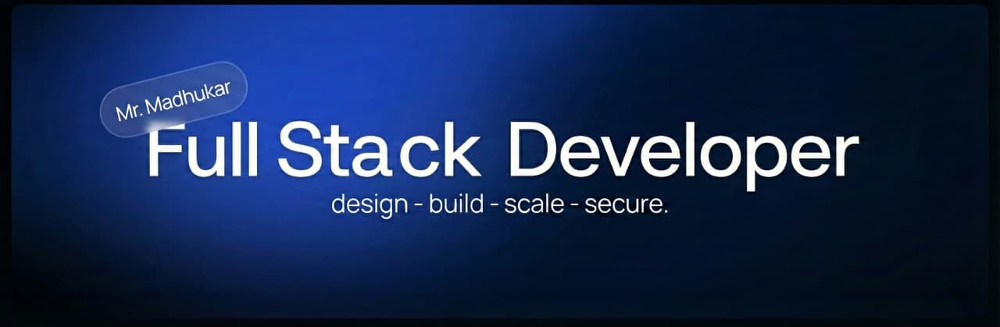

  

  
  
  
  

###  Hi there

- I am **Full-Stack Developer** by day ☼ and **Problem Solver** by night ☾

- I'm currently working on **Building efficient software solutions** that solve real-world challenges and learning **Full-Stack Development (MERN), Data Structures & Algorithms, and exploring DevOps**.

- I'm looking to collaborate on **Software development projects** and **Impactful projects** where I can contribute and learn.

- I'm looking for help with **Finding learning opportunities and internships** in the software development field.

- Ask me about **Java, Python, and Web Development** — The **MERN stack (JavaScript, React, Node.js, Express, MongoDB)** and **Git/GitHub**.

- Happy to connect with **Amazing folks** and build **Awesome network**.

##  Tech Stack

  

<b>📊 GitHub Statistics</b>

 

  
  

  

---

  <i>"Code with passion, build with purpose"</i>

---

### ✍️ Random Dev Quote

  

---

  

