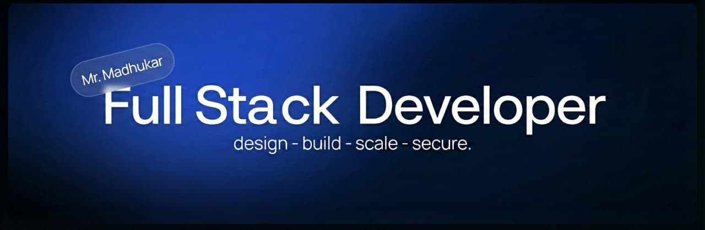

<h1 align="center">Hi , I'm Madhukar</h1>
<h3 align="center">Full-Stack Developer | Backend Engineer | AI-Integrated SaaS Builder</h3>

  

  
  
  
  
  

---

### ✨ About Me

- 🎓 B.Tech in **Computer Science & Engineering** @ Maharishi Markandeshwar (Deemed to be University), 2025 – 2028
- 🏆 Department Topper — Diploma in CSE, Government Polytechnic, Purnea (CGPA 8.43)
- 🥇 **Top 5 — Smart Bihar Hackathon**, IIT Patna
- 💼 Building **My Form** — an AI-native conversational form builder SaaS, and **MailOS** — a keyboard-first AI command center for email & calendar
- ⚙️ Working across **Next.js, tRPC, Drizzle ORM, PostgreSQL, Redis** and the **Vercel AI SDK** inside Turborepo monorepos
- 🔐 Deep focus on **type-safe full-stack architecture**, **custom JWT/OAuth auth**, and **LLM-powered features** (semantic search, streaming agents, function calling)
- 📚 Currently sharpening **System Design, DevOps, and Vector Databases**
- 💬 Ask me about **Next.js, tRPC, Drizzle ORM, JWT Auth, Vercel AI SDK, pgvector/Semantic Search, Docker**
- 🤝 Open to collaborating on **impactful software & AI-SaaS projects**, and looking for **internship opportunities** in full-stack/backend engineering

---

###  Tech Stack

**Languages**

  

**Frontend**

  
  

**Backend**

  
  
  
  
  

**Databases**

  
  

**Gen AI**

  
  
  

**Cloud, DevOps & Tools**

  
  
  

---

<b> GitHub Statistics</b>

 

  
  

  

  

<i>"Code with passion, build with purpose"</i>

###  Random Dev Quote

  

  

